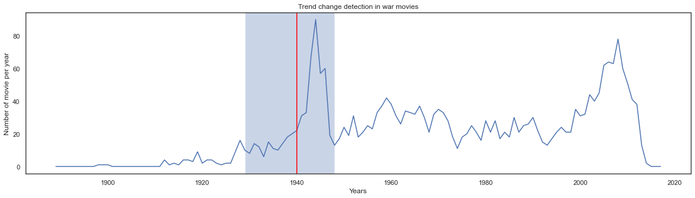
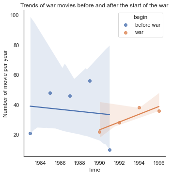
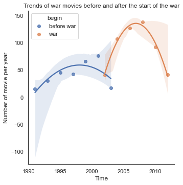
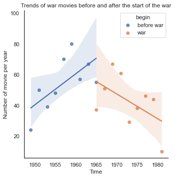
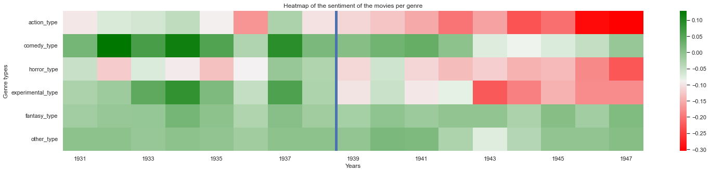
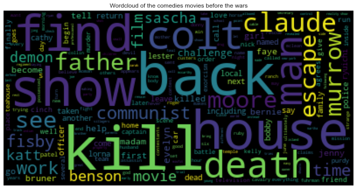
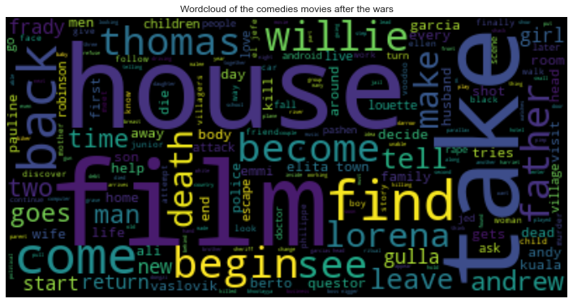
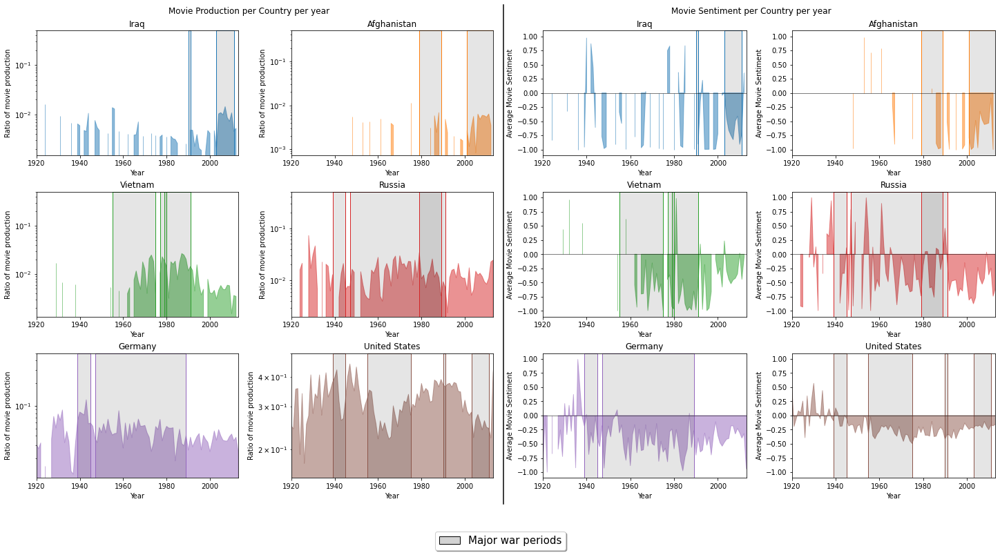

## War and Peace... and Movies
> "It's not the war I hate, it's what it does to people." - Captain John H. Miller, "Saving Private Ryan" (1998)

It's no secret that humans have always had a knack for finding new and creative ways to kill each other. From ancient battles with swords and shields to modern wars with drones and missiles, we just can't seem to resist the urge to go to war. If you were to look at a map of the world, you can see how the globe is covered in red lines just like our soil was tarnished with blood over the centuries.  But, you don’t need to imagine it, here it is:



The consequences of war can be far-reaching and long-lasting, affecting not only the countries directly involved in the conflict, but also the wider world. In the world of film, war has had a significant impact on films, both as a theme and as an influence on filmmakers. Many films have used the backdrop of war to explore themes of conflict and loss  which may lead to shifts in cultural attitudes and sometimes propaganda. It is worth considering whether the depiction of war in films has changed over time.

## Our Strategy for knowledge!
> "I'm just a messenger." - Captain John Miller, "Saving Private Ryan" (1998)

Our dataset being composed of 30’000 American movies, we will focus on the impact of major American wars  on American movies. Our Battle Strategy to uncover the impact of wars on movies to this project is simple: we're going to storm the **CMU Movie Summary Dataset** with all **Natural Language Processing**  guns and **Time series’** shields blazing. We'll be attacking the evolution of war movies’ production and sentiments per genre, then examining how **sentiments** associated with different countries have changed. It's a battle we're prepared to fight, and we won't rest until we've won the war for knowledge!

## Genre-al Warfare: Evolution of Movie Categories
> "I don't understand why everyone is always putting things into categories. I mean, life isn't a genre, it's just life." - Unknown

#### War spotted!

Our first battle in our quest of knowledge will be under the supervision of Genre-al Warfare. We will first conquer movies’ productions by genres and by period. 
First ,we pulled the KATS library of our artillery. KATS is  generalizable framework to perform time series analysis developed by Admiral Zuckerberg. One of the bullets of KATS is CUSUMdetector, a statistical method implemented here to detect change variations in the specified time window, combined with a log likelihood ratio test to test if the mean are significantly different. 

We have inputted **37** time series, one of every movie genre. Despite all time series being on visual, KATS were only able to accurately hit our war movie, and have depicted a **statistical variation** around 1939, without having any additional background check, i.e the method was not aware of WWII and yet detected it as the most significant change.
We can notice two phases in that period: first an **important increase** followed by a sudden **decrease**.
One possible hypothesis is that when the war arose all existing projects were exceptionally speeded up and rushed to be on production before being put on hold due to the war. Then, when the war conditions became too severe, it was not possible to produce anymore. Starting from 1949,, the number of wars stabilised and became more present than it was before.

Now, we would like to focus on war movies production before and after four wars and four dates
* WWII: 1939 (beginning of the year)
* Vietnam: 1966 (year where Muhammed Ali decided to oppose to the war, and popular rise of protests)
* First Golf War: 1990 (year of the war) 
* Iraq’s War: 2002 (Bush decided to launch the attack) 

  
<table>
    <thead>
        <tr>
            <th>Name of war</th>
            <th>Probable analyse before the war</th>
            <th>Probable analyse after the war</th>
            <th>Conclusion</th>
        </tr>
    </thead>
    <tbody>
        <tr>
            <td>WW2</td>
            <td>Stable period before 1939</td>
            <td>Rise and fall of movie production</td>
            <td>Explained previously</td>
        </tr>
        <tr>
            <td>Vietnam</td>
            <td>Increase of war movies</td>
            <td>Decrease of war movies</td>
            <td>Fair to assume that due to the protests, movies wanted to avoid a politically heated topic</td>
        </tr>
        <tr>
            <td>Iraq</td>
            <td>Stable period before 1939</td>
            <td>Rise and fall of movies production</td>
            <td>Rise: to improve war's popularity       Fall: trends don't last right?</td>
        </tr>
        <tr>
            <td>First Golf War</td>
            <td colspan="2">Not conclusive result</td>
            <td>One year war, with less popular impact</td>
        </tr>
    </tbody>
</table>  
 
 

|||
|||

## Attacking Sentiment town!
> "I have a bad feeling about this" - Luke Skywalker
 
*Veni,vidi, vici!* War production per year is ours. It’s time to attack Sentiment per genre town. Allow me to transcribe Genre-al’s great speech:

> “In the battlefield of data analysis, we must always be prepared for the enemy: dirty and unstructured text. But fear not, for we have a secret weapon: the classical NLP cleaning process. First, we strike at the heart of the problem by **removing** stopwords any **special characters** or punctuation that may be hiding in the data. Next, we eliminate any **numerical distractions** by eradicating all numbers from the battlefield. Then, we eliminate the weakest players, the **stop words**, from the field of play. With the text now stripped down to its essentials, we can launch a full-scale attack by dividing it into smaller units, known as **tokens**. We don't stop there, oh no. We also engage in a strategic manoeuvre known as **stemming**, reducing words to their base forms and eliminating any unnecessary redundancies. But beware, the enemy is clever and may try to hide behind contexts and parts of speech. Fear not, for we have a secret weapon for this too: lemmatization. Finally, we conclude our cleaning by **lowercasing** all the words, ensuring that no word is left standing. And with that, our text is clean and ready for analysis, with every word in its rightful place.  But our mission does not end here. We also want to know the **sentiment** of each movie, so we will create a sentiment analysis score for every text. With this score, we can determine the overall sentiment of each movie genre and use this information to better understand the impact of war on film. Victory is ours!"

However, a picture is worth a thousand wars so here’s the picture of Sentiment_per_genre town after the conquer. 
 

After World War II, the **action** and **horror genre in movies became **more negative** in tone, while **comedy** became more **neutral**. One possible interpretation of these trends is that movies are a reflection of society and the changes in the film industry may have been influenced by the events and attitudes of the time.

In the case of the Iraq War, the action genre became less negative, while romance and comedy became more positive. Horror also became more neutral. It is difficult to say for certain why these changes occurred, but it is possible that societal attitudes, industry trends, and political and cultural influences may have all played a role. 

## Funny Side Note:

War is dark. Sometimes, when we face darkness, we tend to use comedy as a way to heal. Therefore we wanted to compare the lexicon used in comedy movie before and after the war by aggregating the plots used before WW2, Vietnam and Iraq and after.

It is interesting to nice that words such as “Kill, escape,death” appeared as most frequent words before the war while “find, house, come, back” appeared as most frequent words after the world.

We suppose that it is easier to do dark humor when you’re not living through dark times, whether we seek comfort after tragedies.

## Imagin-Nation : A battle for Country Sentiments in Movies
> "Your sentiment is admirable, but misplaced." - The Dark Knight

Attention, ADAlites! We are at war with the forces of ignorance and propaganda. And we have a new weapon in our arsenal: the power of **Name Entity Recognition**. By performing name entity recognition on movie texts and detecting the frequency of country mentions, we can uncover the hidden motives behind the portrayal of war. And by analyzing the sentiment of each sentence related to a country, we can see whether movies are being used as a tool for propaganda or to shape public opinion. We will not stand idly by while our enemies try to manipulate the truth. Let us go forth and fight for the truth, with the power of sentiment on our side!"

The following plot represents the results of our analysis on the frequency and sentiment of country mentions in movies. On the left side, we have plotted the **ratio of movie productions** that mention a specific country. To calculate this ratio, we first identified which movies **mention** a particular country, and then **averaged** the number of times that country was mentioned per year, **normalized** by the total number of movies produced in that year to account for variations in movie production. On the right side, we have plotted the **average sentiment score per year per country**. This score reflects the sentiment of the sentences that mention the country in question.

At a high level, we found that the mentions of certain countries coincide with major war periods, and the sentiments associated with these countries are mostly negative.
Upon further examination, we found that **Iraq, and Afghanistan** were frequently mentioned in movies after the 2000s and were mostly associated with **negative sentiments**. This may be a result of the events of **9/11** and the subsequent conflicts in these countries. Vietnam, on the other hand, was mentioned infrequently in movies until the **1960s**, when there was a sudden increase in mentions, peaking in the **1980s**. This increase in mentions may be related to the rise of popular interest (or disinterest) in the Vietnam War and the protests of the 60s. After that, the mentions of Vietnam in movies decreased until the 2000s. Lastly, we found that **Germany** had the highest ration in movies during World War II and the sentiments were generally negative.
Based on this analysis, it appears that the mentions of certain countries in movies coincide with major war periods, and the sentiments associated with these countries are mostly negative. These findings suggest that movies may serve as a reflection of society and its events and conflicts, and the sentiment associated with these events may be reflected in the portrayal of countries in movies. Take a look for yourself and play with this interactive graph and world map.



## A well deserved truce

War has marched through the pages of history, leaving its mark on the world and on the silver screen. Movies are a mirror of society, reflecting its interests and conflicts, its joys and sorrows. And in times of war, the sentiments expressed in movies can be a window into the hearts and minds of the people. But beware: these sentiments are often negative, casting shadows on the human spirit and fueling stereotypes and prejudices. 
